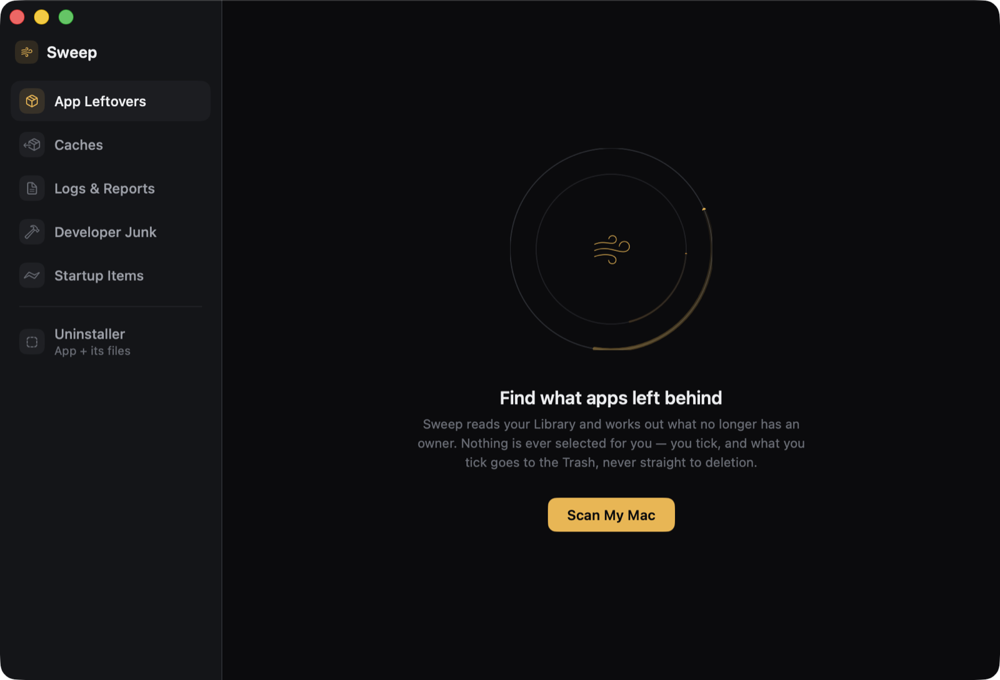
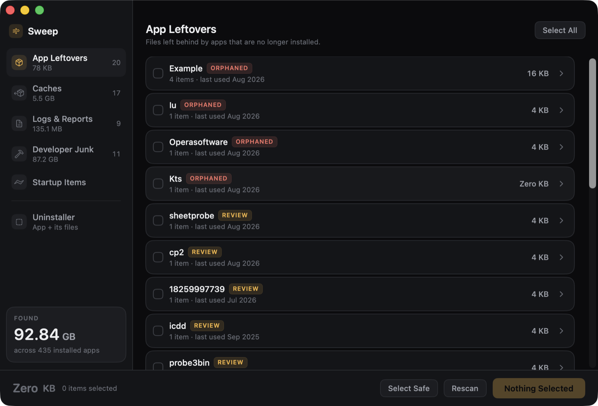
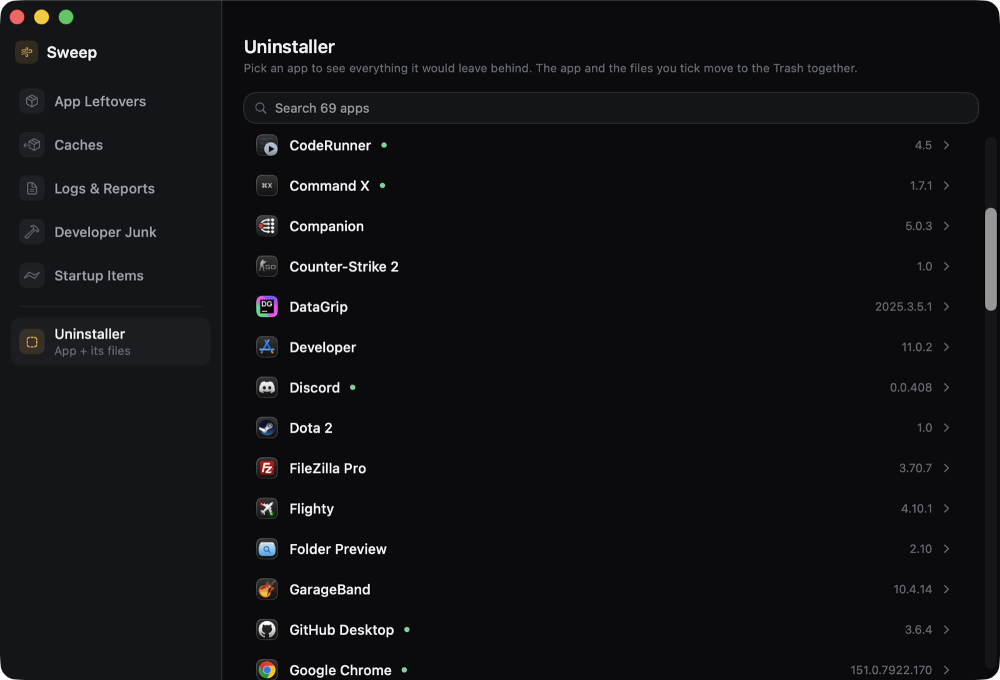
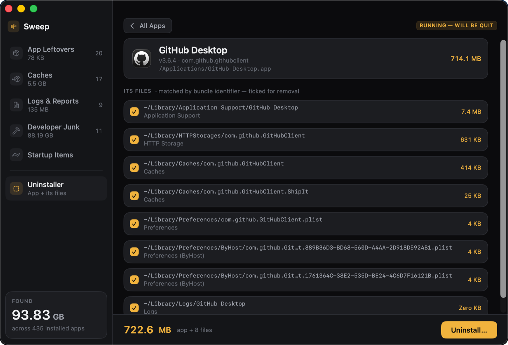

# Sweep

A native macOS cleaner and uninstaller that never deletes, never guesses, and never selects anything for you.



Sweep finds the files applications leave behind — support folders, containers, caches, preferences, launch agents — works out which ones no longer have an owner, and moves only what **you** tick to the Trash. It also uninstalls apps properly: pick one, see everything it owns, and remove the app and its files together.

**Scan results — evidence labelled, nothing pre-selected:**



**The uninstaller — pick any installed app:**



**…and get a removal plan: the app, everything it owns, shared data left alone:**



## What it finds

| Category | Contents |
|---|---|
| **App Leftovers** | Files from apps that are no longer installed, matched by bundle-identifier evidence |
| **Caches** | Rebuildable cache data — caches of apps you still have are labelled *In Use*, never "safe" |
| **Logs & Reports** | Third-party logs and crash reports |
| **Developer Junk** | Xcode derived data, archives, device support, simulator and package-manager caches |
| **Startup Items** | Launch agents and daemons that are broken or orphaned, plus a read-only list of everything else that loads at login |
| **Uninstaller** | An app and all of its files in one move — data shared by other installed apps is never touched |

## Why it's safe

This is the actual product. Cleaner apps break Macs by guessing; Sweep is built so a wrong guess cannot destroy anything.

- **Trash-only.** Every removal uses the system Trash — recoverable with Put Back. System-level files move to a timestamped folder inside the Trash via a single admin prompt. There is no code path that deletes.
- **Nothing is auto-selected.** A scan ends with zero ticks. "Select Safe" batches the ownerless, rebuildable tier — one explicit click.
- **Evidence is labelled.** *Orphaned* (bundle-id proof), *Review* (name match only), *Safe* (no owner, rebuildable), *In Use* (owner still installed). Every path is shown; nothing hides behind a number.
- **Shared data is untouchable.** Uninstalling Word leaves Office's shared containers alone — and tells you which apps they are shared with. Cross-app licensing SDKs (Paddle, FLEXnet, PACE and friends) are refused outright.
- **An allow-list policy gate** validates every path twice: when it is proposed, and again at the moment of removal. `/System`, Documents, photo and mail libraries, and Apple's own files are structurally out of reach.
- **It fails closed.** If the installed-app inventory looks incomplete, inferential scanning refuses to run rather than flag everything.
- **Honest sizes.** Hard-link-aware, package-aware measurement that agrees with `du`.
- **No dependencies, no telemetry, no network.** Apple frameworks only.

## Install

Download the latest notarized `.dmg` from [Releases](https://github.com/gasanache/Sweep/releases), open it, and drag Sweep to Applications. Universal binary, macOS 15.6+.

## Building from source

Requires macOS 15.6 or newer and Xcode 26.

```sh
git clone https://github.com/gasanache/Sweep.git
cd Sweep
./build.sh --run        # build Release and launch
./build.sh --install    # copy to /Applications
```

Or open `Sweep.xcodeproj` and hit Run. The app is **not sandboxed** — a cleaner has to read `~/Library` — so it ships with Hardened Runtime and Developer ID signing instead. It is not App Store-eligible by design.

## Tests

```sh
xcodebuild test -project Sweep.xcodeproj -scheme Sweep -destination 'platform=macOS' CODE_SIGNING_ALLOWED=NO
```

45 unit tests pin the parts that must never regress: the safety policy's refusals, orphan matching against real-world false positives, the uninstaller's shared-data classifier, quarantine name collisions, and the selection policy. A headless harness additionally verifies full scans and uninstall plans against a live machine.

## Roadmap

- SmartDelete-style watcher — offer leftover cleanup when an app is dragged to the Trash

## License

[GPL-3.0](LICENSE). Chosen deliberately: Sweep's whole pitch is that you can read the source and verify it never deletes anything — so forks have to keep their source readable too.

© 2026 George Asanache
