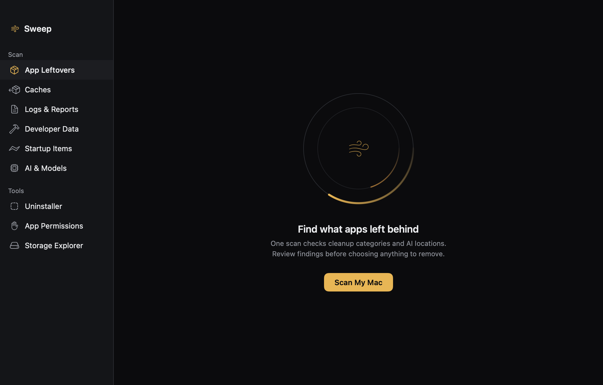
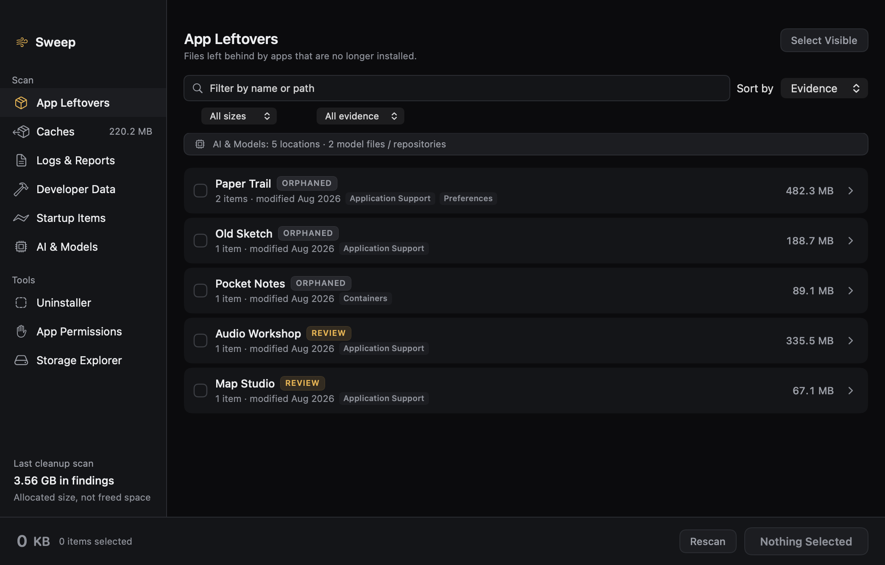
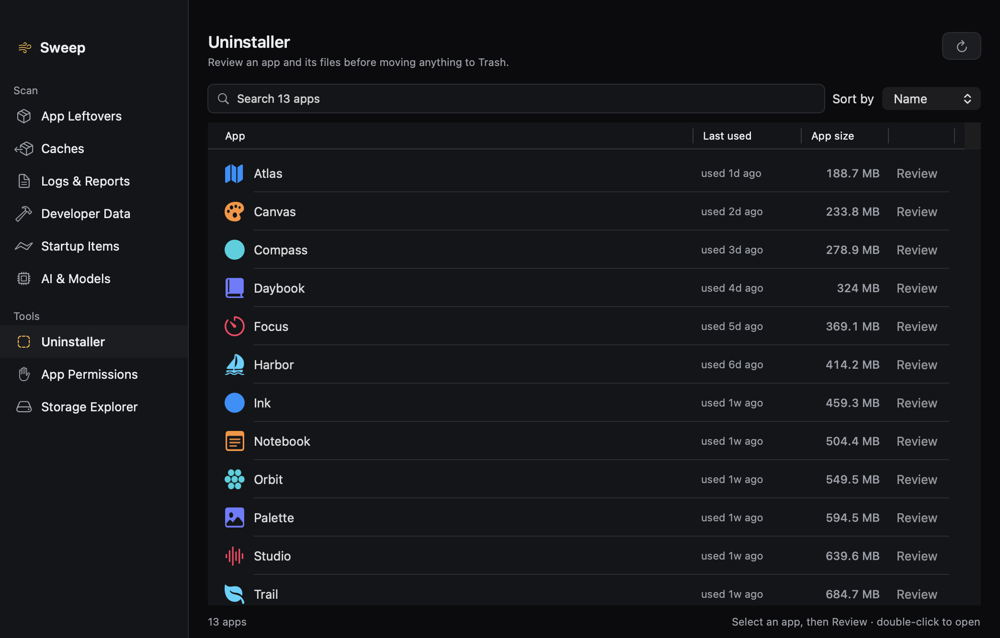
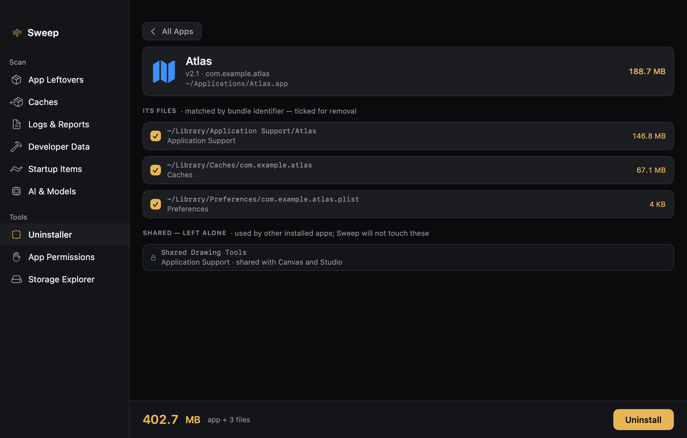
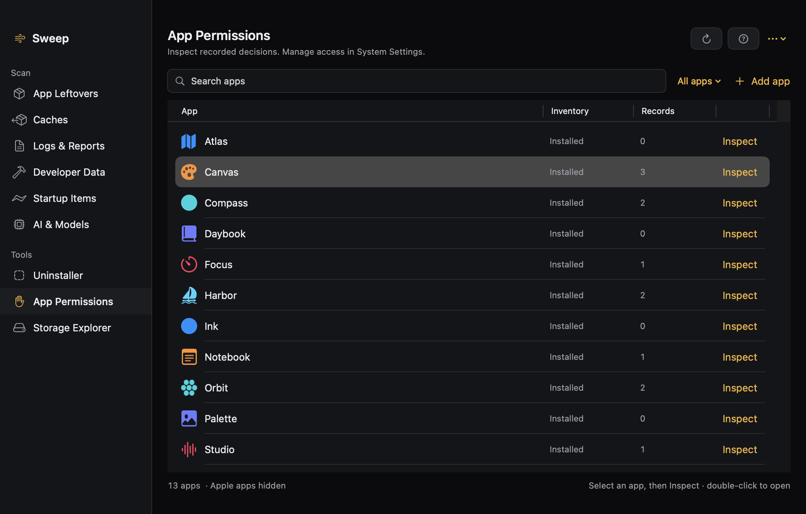
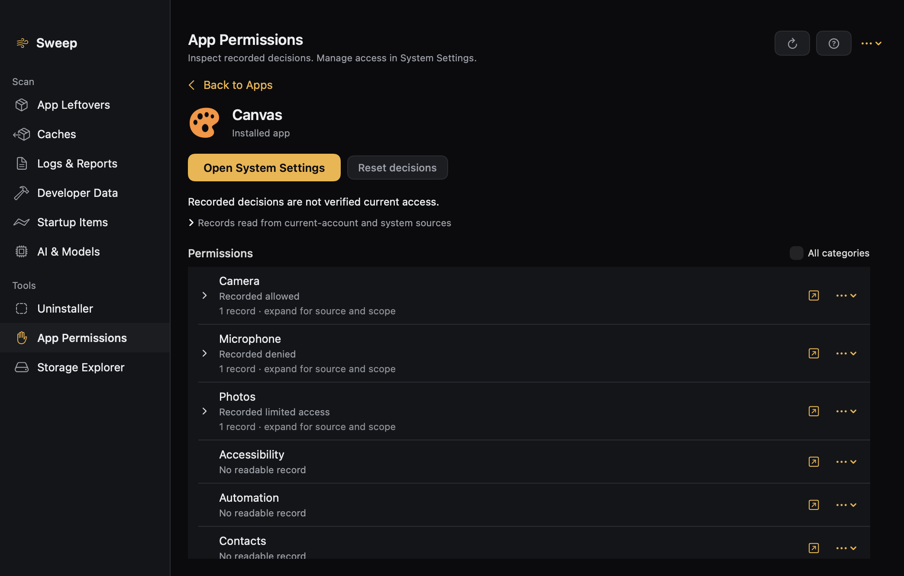
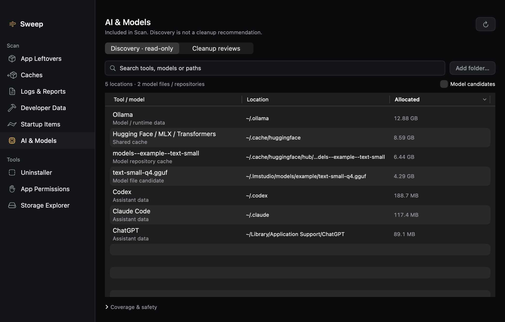
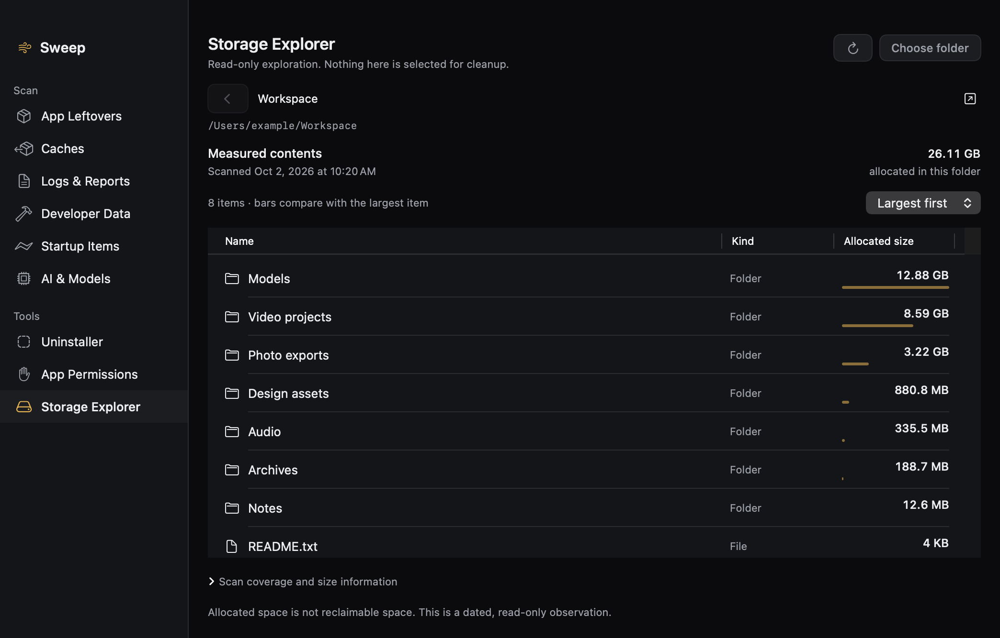

# Sweep

A native macOS utility for cleaning up app data, uninstalling applications, inspecting recorded permissions, and browsing local AI models and disk usage.



## Install

```sh
brew tap gasanache/tap https://github.com/gasanache/Sweep
brew install --cask gasanache/tap/sweep
```

Or download the notarized `.dmg` from [Releases](https://github.com/gasanache/Sweep/releases) and drag Sweep to Applications. Universal binary, macOS 15.6+.

Update with `brew upgrade --cask sweep` or download a newer release. Sweep has no built-in updater.

## Scan

One scan checks these categories and discovers common AI locations. Cleaner findings start unselected; you choose what to remove.

| Category | Contents |
|---|---|
| **App Leftovers** | Support folders, containers and preferences attributed to apps no longer installed |
| **Caches** | Rebuildable caches, with installed owners labelled *In Use* |
| **Logs & Reports** | Third-party logs and crash reports |
| **Developer Data** | Xcode data, simulator data and package-manager caches |
| **Startup Items** | Broken or orphaned launch agents and daemons; other startup entries are read-only |
| **AI & Models** | Model candidates, shared caches and assistant data; discovery is read-only |

Search by name or path, filter by size and ownership evidence, and expand a group to inspect its paths. Selection commands affect the visible results; hidden selections are counted separately. Rescans retain still-valid selections. Dates describe modification, not usage.



## Uninstaller

Find an app by name, size or last use, then choose **Review**. The plan separates attributed files from name-only matches and data shared with other installed apps. Shared data is excluded; installer receipts and system extensions are flagged rather than removed.



<details>
<summary>Example removal plan</summary>



</details>

## App Permissions

Browse the full-width app list, then choose **Inspect** or double-click a row. **Back to Apps** returns to the list with your search, filters and selection intact. Apple apps are hidden by default; the filter can include them or show installed and recorded-only clients separately. **Add app** includes an application outside the usual Applications folders.



Permission details show recorded decisions and their sources, not verified current access. Expand a category to inspect individual records and Automation targets. Missing or unreadable records mean **unknown**, not denied. Full Disk Access may be needed to read protected records; recent decisions may be absent from checkpointed database snapshots.

- **Change access in System Settings.** Sweep opens the relevant macOS controls. It does not provide fake permission switches or write to protected permission databases.
- **Reset decisions** for one app from its details, or choose **Reset across apps** from the toolbar’s advanced menu. Confirm the category, app identifier and account scope. Copies of an app with the same bundle identifier share that scope.
- All-app and all-account resets require typing `RESET`. The default is the current account; resetting across accounts requires macOS administrator authorization. A failed operation never falls back to a broader reset.
- A reset removes allowed and denied decisions so apps may ask again. **There is no undo.** Managed policies and controls outside TCC are not reset. Local Network, Location Services, notifications and other controls may need their own Settings pages.

<details>
<summary>Recorded permission details</summary>



</details>

## AI & Models

Search and sort a read-only inventory of model-file candidates, repositories, shared caches and assistant data. Common locations include LM Studio, Ollama, Hugging Face, MLX, PyTorch, Jan, GPT4All and Msty, plus Codex, ChatGPT, Claude Code, Cursor, Gemini CLI and OpenCode.

Use **Add folder…** to inspect another location for the current session. Discovery reads metadata, not model contents, credentials or conversations. It does not execute discovered tools, follow symbolic links or download cloud-only files. Coverage limits and unknown measurements remain visible; this is not a whole-disk search.



Discovery is **not a cleanup recommendation**. AI findings stay outside cleanup totals and bulk selection. Known assistant/model locations and added inspection roots are protected from generic removal, including their aggregate parents. Added roots remain protected until Sweep quits, even after you stop inspecting them.

### LM Studio and Ollama cleanup

**Cleanup reviews** is a separate workflow for these two products, also used when selecting them in Uninstaller. Review exact paths, runtime/service checks, shell-profile changes and Homebrew packages before proceeding. Unknown ownership, unsupported package instructions and running runtimes can block removal.

Approved data and app bundles go to Trash; approved Homebrew package removal is permanent. Custom model folders and shared Hugging Face caches are preserved. Models, chats, settings and credentials inside an approved product folder are included in its removal, so keep anything you still need. File recovery does not reinstall packages; shell-profile backups require manual recovery.

## Storage Explorer

Choose a folder to browse its largest children, sort entries, follow breadcrumbs or reveal a path in Finder. Double-click or press Return to browse; use the left arrow or **⌘[** to go back. Nothing here is selected for cleanup.



The scan does not follow links, cross filesystem boundaries or download cloud-only files. Packages are measured as units and hard links are counted once. Unreadable entries and traversal limits are reported as partial coverage. **Rescan** refreshes the dated snapshot; allocated sizes are not estimates of reclaimable space.

*Screenshots use fictional example data.*

## Removal and recovery

- **Review before removal.** Confirmations freeze the complete selection and show exact paths, including selections outside the current filter. Cancelling performs no removal.
- **Ownership matters.** Bundle identifiers, installed apps, receipts and loaded jobs inform attribution. Name-only matches require review. Incomplete inventories do not turn unknown ownership into a safe finding.
- **Protected paths stay protected.** An allow-list is checked when a target is proposed and again before removal. Shared data, protected libraries and linked ancestry are refused. Right-click a group to ignore it in future scans.
- **Files go to Trash.** User moves use no-follow directory descriptors and exclusive renames, with recovery intent saved before mutation. Cross-volume moves are refused rather than copied and deleted. Live filesystem changes are not an atomic-snapshot guarantee.
- **Restore Last Batch** restores supported files from the newest nonempty batch without overwriting existing files. Recovery works after relaunch. Some administrator-owned locations require manual recovery; Finder’s Put Back metadata is not created.
- **Some actions are irreversible.** Homebrew package removal, simulator deletion and permission resets are separate, explicit operations. Restoring a startup configuration does not reload its job. Partial failures and unknown outcomes remain visible.
- **Trash still uses disk space.** Allocated sizes account for hard links but cannot promise savings from APFS clones, compression or snapshots.
- **No telemetry or model downloads.** Approved Homebrew operations may use Homebrew’s own network access and caches; Sweep disables its automatic updates, analytics, autoremove and incidental install cleanup for those commands.

## Interface

Scan and Tools have separate navigation sections. The interface supports light and dark appearances, native keyboard selection, system scrollbar preferences and Reduce Motion. The default window is **1044 × 667 points**; resizing and normal macOS window restoration remain enabled.

## Build

Requires macOS 15.6+ and Xcode 26.

```sh
git clone https://github.com/gasanache/Sweep.git
cd Sweep
./build.sh --run        # build Release and launch
./build.sh --install    # copy to /Applications
```

`build.sh` requires a configured Developer ID signing identity. It verifies the signature before replacing `build/Sweep.app` and preserves versioned release folders. For your own signing setup, open `Sweep.xcodeproj` and run the Sweep scheme.

Sweep is not sandboxed because it needs to inspect application data in `~/Library`. Distributed builds use Hardened Runtime and Developer ID signing.

## Tests

```sh
xcodebuild test -project Sweep.xcodeproj -scheme Sweep \
  -destination 'platform=macOS' CODE_SIGNING_ALLOWED=NO
./Scripts/verify.sh --compile-only
./Scripts/verify-workflows.sh
```

Tests cover ownership matching, removal/refusal policy, recovery, stale workers, partial outcomes, privacy scope, read-only discovery and UI store state. Mutation tests use isolated fixtures, not real applications, packages or permissions. Administrator authorization and recovery compatibility also need integration testing on a suitable test system.

Run `./Scripts/verify.sh` without `--compile-only` for read-only checks against the current machine’s ownership inventory and uninstall plans. It removes nothing and deletes its temporary executable on exit.

## Command line

Build the **SweepCLI** scheme for the optional read-only CLI:

```sh
sweep scan
sweep plan <app>
sweep verify
sweep ai --json
sweep ai /path/to/models --json
sweep local-ai --json
```

All commands support `--json`. The CLI has no removal verb. `ai` inspects metadata; `local-ai` prepares LM Studio/Ollama cleanup plans without executing them.

## License

[GPL-3.0](LICENSE). Some workflow ideas were inspired by [PureMac](https://github.com/momenbasel/PureMac/) ([MIT](https://github.com/momenbasel/PureMac/blob/main/LICENSE)); the implementation is independent, with no upstream code or assets copied.

© 2026 George Asanache
